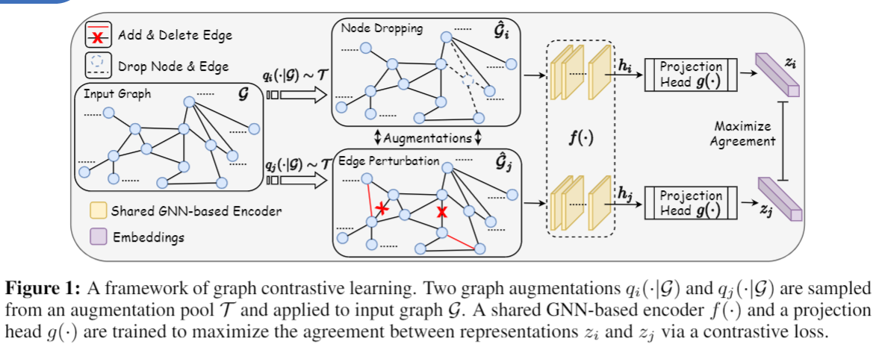
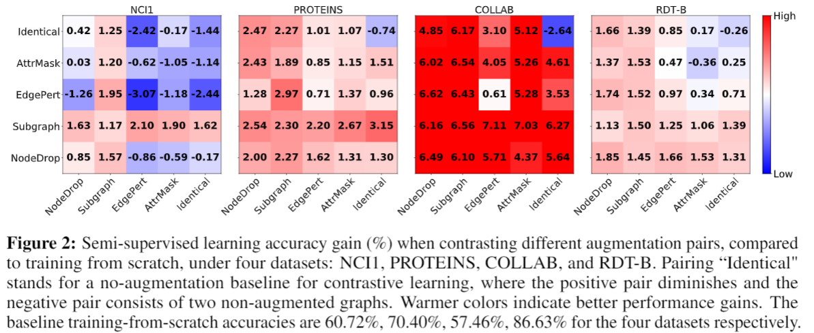

# Graph Contrastive Learning with Augmentations

PyTorch implementation for [Graph Contrastive Learning with Augmentations](https://arxiv.org/abs/2010.13902) [[poster]](https://yyou1996.github.io/files/neurips2020_graphcl_poster.pdf) [[appendix]](https://yyou1996.github.io/files/neurips2020_graphcl_supplement.pdf)

Yuning You<sup>\*</sup>, Tianlong Chen<sup>\*</sup>, Yongduo Sui, Ting Chen, Zhangyang Wang, Yang Shen

In NeurIPS 2020.


## External links

For the automated version of GraphCL, please refer to https://github.com/Shen-Lab/GraphCL_Automated.

For the extention of GraphCL to hypergraphs, please refer to https://github.com/weitianxin/HyperGCL.

For the most comprehensive collection of graph SSL papers, please refer to https://github.com/ChandlerBang/awesome-self-supervised-gnn.


## Overview

In this repository, we develop contrastive learning with augmentations for GNN pre-training (GraphCL, Figure 1) to address the challenge of data heterogeneity in graphs.
Systematic study is performed as shown in Figure 2, to assess the performance of contrasting different augmentations on various types of datasets.





## Experiments

* [The Role of Data Augmentation](https://github.com/Shen-Lab/GraphCL/tree/master/semisupervised_TU#exploring-the-role-of-data-augmentation-in-graphcl)
* Semi-supervised learning [[TU Datasets]](https://github.com/Shen-Lab/GraphCL/tree/master/semisupervised_TU#graphcl-with-sampled-augmentations) [[MNIST and CIFAR10]](https://github.com/Shen-Lab/GraphCL/tree/master/semisupervised_MNIST_CIFAR10)
* Unsupervised representation learning [[TU Datasets]](https://github.com/Shen-Lab/GraphCL/tree/master/unsupervised_TU) [[Cora and Citeseer]](https://github.com/Shen-Lab/GraphCL/tree/master/unsupervised_Cora_Citeseer)
* Transfer learning [[MoleculeNet and PPI]](https://github.com/Shen-Lab/GraphCL/tree/master/transferLearning_MoleculeNet_PPI)
* Adversarial robustness [[Component Graphs]](https://github.com/Shen-Lab/GraphCL/tree/master/adversarialRobustness_Component)

## Potential Issues
Some issues might occur due to the version mismatch. I collect them as follows (keep updating).
* ```KeyError:'num_nodes'``` in unsupervised_TU: https://github.com/Shen-Lab/GraphCL/issues/36, https://github.com/Shen-Lab/GraphCL/issues/41
* ```AttributeError: 'Data' object has no attribute 'cat_dim'``` in transferLearning_MoleculeNet_PPI: https://github.com/Shen-Lab/GraphCL/issues/13
* Bugs in subgraph implementation: https://github.com/Shen-Lab/GraphCL/issues/24
* Loss of negative values in transfer learning: https://github.com/Shen-Lab/GraphCL/issues/50

## Citation

If you use this code for you research, please cite our paper.

```
@inproceedings{You2020GraphCL,
 author = {You, Yuning and Chen, Tianlong and Sui, Yongduo and Chen, Ting and Wang, Zhangyang and Shen, Yang},
 booktitle = {Advances in Neural Information Processing Systems},
 editor = {H. Larochelle and M. Ranzato and R. Hadsell and M. F. Balcan and H. Lin},
 pages = {5812--5823},
 publisher = {Curran Associates, Inc.},
 title = {Graph Contrastive Learning with Augmentations},
 url = {https://proceedings.neurips.cc/paper/2020/file/3fe230348e9a12c13120749e3f9fa4cd-Paper.pdf},
 volume = {33},
 year = {2020}
}
```

